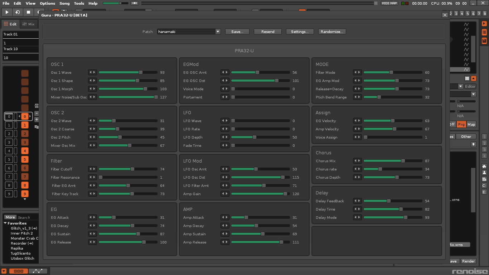

# PRA32-U Editor for Renoise
A parameter editor for the PRA32-U synthesizer, built as a Renoise Tool using **Guru**.

---

## 📸 Screenshots

### Main Screen

---

## 🎬 Demo Video

### PRA32-U Editor Demo

### PRA32-U　Demo

---

## 🎛 Overview
**PRA32-U Editor for Renoise** provides a way to edit parameters of the hardware synthesizer **PRA32-U** directly inside Renoise.

This tool is implemented as a **synth definition for Guru**, an extended UI framework for Renoise Tools.  
Guru allows developers to build custom instrument editors using Lua.

Learn more about Guru here:  
https://www.renoise.com/tools/guru

---

## ✨ Features
- Edit PRA32-U parameters directly within Renoise  
- Sends MIDI CC messages in real time  
- Clean and intuitive UI powered by Guru  
- Lightweight and fully integrated into the Renoise workflow  
- Future plans include preset management and bidirectional MIDI communication

---

## 📦 Installation

This tool runs inside **Guru**.  
To install the PRA32-U definition for Guru, follow these steps:
1. Locate your Renoise user tools folder:
  C:\Users\USERNAME\AppData\Roaming\Renoise\V3.5.0\Scripts\Tools\
2. Open the Guru tool folder:
  com.cornbeast.Guru.xrnx\synthdefinitions\

3. Copy the file **`pra32_u.lua`** from this repository into the `synthdefinitions` folder.

4. Restart Renoise.

After restarting, Guru will automatically detect the new synthesizer definition, and  
**PRA32-U** will appear as an available instrument inside Guru.

---

## 🛠 Requirements
- Renoise 3.5 or later  
- Guru (Renoise Tools)  
  https://www.renoise.com/tools/guru

---

## 🚧 Roadmap
- Full parameter coverage for PRA32-U  
- Bidirectional MIDI (read parameter values from hardware)  
- Preset save/load system  
- Integration with Renoise Pattern Editor  
- Optional custom UI skins  
- Parameter smoothing and improved CC handling

---

## 🤝 Special Thanks
  Powerd By ISGK Instruments PRA32-U

---

## 📜 License
MIT License

